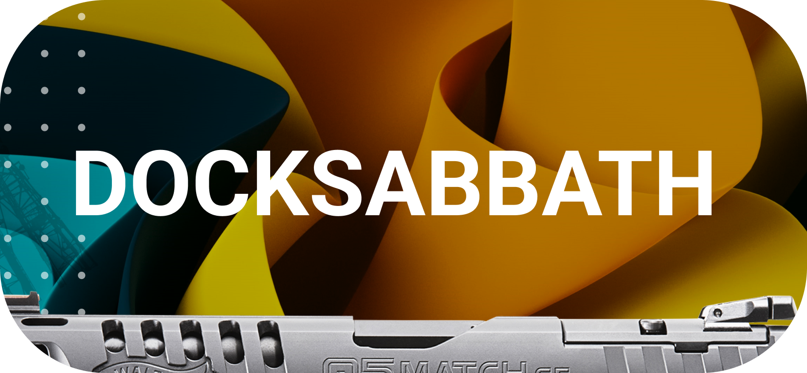

<h1 align="center">
   
  
   
  DockSabbath Client
</h1>

<small  >
This is like kubectl, but for the dumb and the poor. I made it for myself.
</small>

## About DockSabbath Client
This is a client for DockSabbath. You install it on your computer and use it to connect to the server in order to check the statuses of namespaces and Docker containers.

##   Installation 
1. Download the latest release and unzip it into a convenient folder.
2. Open config.json and specify the server token and its name. You can enter any name that is convenient for you.
3. Open the folder in the command line and enter "docksab" to check that everything is working.
4. Then enter "docksab serverName ns" to view the namespaces on your VDS.
 

## Server app
https://github.com/slavaWins/DockSabbath